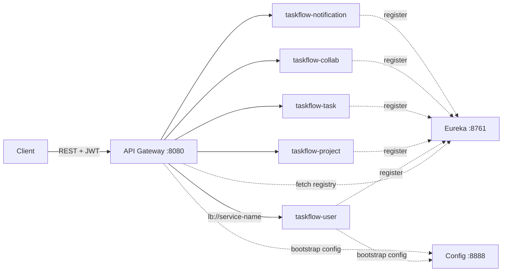

# TaskFlow — Gateway, Eureka & Config Server

Tài liệu giải thích chi tiết cách hoạt động của **API Gateway**, **Eureka (Service Discovery)** và **Spring Cloud Config** trong dự án TaskFlow — dựa trên code và cấu hình thực tế trong repo.

---

## Mục lục

1. [Tổng quan vai trò](#1-tổng-quan-vai-trò)
2. [Luồng request end-to-end](#2-luồng-request-end-to-end)
3. [Eureka — Service Discovery](#3-eureka--service-discovery)
4. [Config Server — Centralized Config](#4-config-server--centralized-config)
5. [API Gateway — Routing & JWT](#5-api-gateway--routing--jwt)
6. [Tích hợp Docker Compose](#6-tích-hợp-docker-compose)
7. [Thứ tự khởi động & troubleshooting](#7-thứ-tự-khởi-động--troubleshooting)
8. [Tham chiếu file trong repo](#8-tham-chiếu-file-trong-repo)

---

## 1. Tổng quan vai trò

| Thành phần | Port mặc định | Vai trò |
|---|---|---|
| **Eureka Server** | 8761 | “Danh bạ” — lưu danh sách instance đang chạy của mỗi service |
| **Config Server** | 8888 | “Kho cấu hình” — phục vụ YAML/properties tập trung cho các service |
| **API Gateway** | 8080 | “Cổng vào” — JWT, CORS, routing, chặn `/internal/**` |

Client (FE, cURL, Postman) **chỉ gọi Gateway** (`http://localhost:8080`). Gateway không chứa business logic; nó forward request sang microservice phù hợp.



---

## 2. Luồng request end-to-end

Ví dụ: `GET /api/v1/projects` với header `Authorization: Bearer <token>`.

```
1. Client → Gateway :8080
2. JwtAuthGatewayFilter (GlobalFilter, order = -100)
   ├── OPTIONS? → bỏ qua JWT (CORS preflight)
   ├── Path public? → bỏ qua JWT (login, register, ...)
   ├── Thiếu/invalid JWT? → 401
   ├── Token bị revoke (Redis)? → 401
   └── OK → gắn X-User-Id, X-Username, X-User-Email, X-Trace-Id
3. Spring Cloud Gateway match route theo Path predicate
4. Route uri = lb://taskflow-project
   └── LoadBalancer hỏi Eureka → lấy host:port instance
5. Forward HTTP tới Project Service
6. Controller đọc userId qua SecurityHeaderUtils.currentUserId()
```

**Điểm quan trọng:** Service downstream **không verify lại JWT**. Nó tin header `X-User-Id` do Gateway gắn (mạng nội bộ Docker / không expose port service ra host).

---

## 3. Eureka — Service Discovery

### 3.1. Eureka Server

**Module:** `code/taskflow-eureka`

**Annotation kích hoạt server:**

```java
@EnableEurekaServer
@SpringBootApplication
public class EurekaApplication { ... }
```

**Cấu hình** (`application.yml`):

```yaml
eureka:
  client:
    register-with-eureka: false   # Server không tự đăng ký
    fetch-registry: false
  server:
    enable-self-preservation: false
    eviction-interval-timer-in-ms: 15000
```

- `register-with-eureka: false` — Eureka chỉ là registry, không phải client.
- `enable-self-preservation: false` — dev: instance chết sẽ bị gỡ khỏi registry nhanh hơn (tránh “ghost instance”).

**Dashboard:** http://localhost:8761 — xem danh sách `APPLICATION` (taskflow-user, taskflow-project, …).

### 3.2. Eureka Client (các microservice + Gateway)

Mỗi service business có:

```yaml
eureka:
  client:
    service-url:
      defaultZone: ${EUREKA_URL:http://localhost:8761/eureka/}
    register-with-eureka: true
    fetch-registry: true
  instance:
    prefer-ip-address: true
```

Và annotation `@EnableDiscoveryClient` trên `*Application.java` (User, Project, Task, Collab, Notification).

**Khi service start:**

1. Gửi `REGISTER` tới Eureka với `spring.application.name` (vd `taskflow-user`).
2. Gửi heartbeat định kỳ (~30s).
3. Các client khác (Gateway) `fetch-registry` để biết instance nào đang UP.

### 3.3. Vì sao `lb://taskflow-user` hoạt động?

Trong Gateway route:

```yaml
uri: lb://taskflow-user
```

- `lb://` = Spring Cloud **LoadBalancer** + Eureka.
- Gateway resolve `taskflow-user` → danh sách instance từ registry → chọn một instance → forward request.

Không cần hard-code `http://localhost:8081` trong Gateway. Port/host thay đổi (Docker, scale) vẫn hoạt động miễn là đăng ký Eureka đúng tên.

---

## 4. Config Server — Centralized Config

### 4.1. Config Server

**Module:** `code/taskflow-config`

```java
@EnableConfigServer
@SpringBootApplication
public class ConfigServerApplication { ... }
```

**Backend:** profile `native` — đọc file từ filesystem (không dùng Git):

```yaml
spring:
  profiles:
    active: native
  cloud:
    config:
      server:
        native:
          search-locations: ${CONFIG_REPO_PATH:file:./config-repo}
```

**Thư mục config:** `code/taskflow-config/config-repo/`

Hiện tại chỉ có file dùng chung:

| File | Nội dung |
|---|---|
| `application.yml` | `management.*`, `logging.*` (fallback cho mọi service) |

Config Server cũng đăng ký Eureka (`register-with-eureka: true`) để có thể discover qua tên nếu cần.

### 4.2. Config Client (mỗi service)

**File:** `src/main/resources/bootstrap.yml` (load **trước** `application.yml`)

```yaml
spring:
  application:
    name: taskflow-user    # tên khác nhau mỗi service
  cloud:
    config:
      uri: ${CONFIG_URI:http://localhost:8888}
      fail-fast: false
```

**Cơ chế Spring Cloud Config:**

- Client gọi Config Server theo pattern: `/{application}/{profile}[/{label}]`
- Ví dụ: `GET http://localhost:8888/taskflow-user/default`
- Property từ Config Server **merge** vào (override) config local.

**`fail-fast: false`:** Nếu Config Server chưa sẵn sàng hoặc không có file riêng cho service → **không crash**, dùng `application.yml` trong JAR. Đây là lý do hệ thống vẫn chạy được dù `config-repo` chưa có `taskflow-user.yml`, `taskflow-gateway.yml`, …

### 4.3. Thứ tự load cấu hình

```
bootstrap.yml  →  (fetch Config Server)  →  application.yml  →  Environment variables
```

Ưu tiên cao hơn ở bên phải (env override mọi thứ).

---

## 5. API Gateway — Routing & JWT

### 5.1. Dependencies chính

`taskflow-gateway/pom.xml`:

- `spring-cloud-starter-gateway` — reactive gateway
- `spring-cloud-starter-netflix-eureka-client` — discovery
- `spring-cloud-starter-config` + `bootstrap` — centralized config
- `jjwt` — parse JWT
- `spring-boot-starter-data-redis-reactive` — check token revocation

### 5.2. Bảng routing

| Route ID | URI | Path predicate | Ghi chú |
|---|---|---|---|
| `user-auth` | `lb://taskflow-user` | `/api/v1/auth/**` | Public (JWT whitelist) |
| `user-service` | `lb://taskflow-user` | `/api/v1/users/**` | |
| `project-service` | `lb://taskflow-project` | `/api/v1/projects/**`, boards, lists, sprints | |
| `collab-task-nested` | `lb://taskflow-collab` | `/api/v1/tasks/*/comments/**`, `.../attachments/**` | **Đặt trước** task-service |
| `task-service` | `lb://taskflow-task` | `/api/v1/tasks/**`, checklists, labels | |
| `collab-service` | `lb://taskflow-collab` | comments, attachments, activities | |
| `notification-service` | `lb://taskflow-notification` | `/api/v1/notifications/**` | |
| `notification-ws` | `lb:ws://taskflow-notification` | `/ws/**` | WebSocket STOMP |
| `block-internal` | `forward:/_blocked` | `/api/v1/internal/**`, `/internal/**` | Trả 404 |

**Quy tắc thứ tự route:** Gateway match route **theo thứ tự khai báo**. Route cụ thể hơn (`/tasks/*/comments/**`) phải đứng **trước** route rộng (`/tasks/**`).

### 5.3. JWT GlobalFilter

**Class:** `com.taskflow.gateway.filter.JwtAuthGatewayFilter`

| Bước | Hành vi |
|---|---|
| 1 | `OPTIONS` → pass (CORS preflight) |
| 2 | Luôn set/generate `X-Trace-Id` |
| 3 | Path trong `PUBLIC_PATHS` → pass không cần JWT |
| 4 | Đọc `Authorization: Bearer ...` |
| 5 | Parse JWT với secret `jwt.access-token.secret-key` |
| 6 | Redis key `jwt:{userId}:ACCESS_TOKEN` — so khớp token (revocation / single session) |
| 7 | Gắn `X-User-Id`, `X-Username`, `X-User-Email` → forward |

**Public paths (prefix match):**

- `/api/v1/auth/register`, `login`, `refresh`, `forgot-password`, `reset-password`
- `/api/v1/users/avatars/` (avatar public URL)
- `/actuator/`
- `/_blocked`

**Lỗi 401** kèm header `X-Error-Code`: `missing_token`, `invalid_token`, `token_revoked`.

### 5.4. Service downstream đọc identity

**Shared lib:** `taskflow-common` → `SecurityHeaderUtils`

```java
public static Long currentUserId() {
    String value = req.getHeader("X-User-Id");
    // thiếu hoặc invalid → UnauthorizedException
}
```

Controller ví dụ:

```java
taskService.create(SecurityHeaderUtils.currentUserId(), req);
```

### 5.5. Chặn endpoint nội bộ

Route `block-internal` forward tới `/_blocked` → `BlockedController` trả HTTP 404 với body `endpoint_not_exposed`.

Các API `/internal/**` chỉ gọi được **service-to-service** trong Docker network, không qua Gateway.

### 5.6. CORS

`globalcors` cho phép `http://localhost:*`, `http://127.0.0.1:*` — phục vụ FE dev (Vite :5173).

---

## 6. Tích hợp Docker Compose

File `docker-compose.yml` — biến dùng chung:

```yaml
x-spring-common-env:
  EUREKA_URL: http://eureka:8761/eureka/
  CONFIG_URI: http://config:8888
  JWT_ACCESS_SECRET: ${JWT_ACCESS_SECRET}
  ...
```

**Thứ tự `depends_on` (healthcheck):**

```
postgres, redis, rabbitmq, minio
    → eureka
    → config
    → user-service
    → project-service
    → task-service
    → collab-service
    → notification-service
    → gateway
    → fe
```

**Chỉ Gateway (+ FE) expose port ra host.** Service 8081–8085 chỉ trong network `taskflow`.

Config image copy `config-repo` vào `/app/config-repo`:

```dockerfile
COPY --from=build .../config-repo /app/config-repo
```

Env `CONFIG_REPO_PATH: file:/app/config-repo` trỏ đúng thư mục đó.

---

## 7. Thứ tự khởi động & troubleshooting

### 7.1. Manual dev

```
Eureka → Config → User → Project → Task → Collab → Notification → Gateway
```

Đợi **~30 giây** sau khi Gateway UP trước khi gọi API (Eureka heartbeat sync).

### 7.2. Smoke test nhanh

```bash
# Login (public — không cần token)
curl -s -X POST http://localhost:8080/api/v1/auth/login \
  -H "Content-Type: application/json" \
  -d '{"username":"alice","password":"secret123"}'

# Eureka dashboard
open http://localhost:8761

# Config health
curl http://localhost:8888/actuator/health
```

### 7.3. Lỗi thường gặp

| Triệu chứng | Nguyên nhân | Cách xử lý |
|---|---|---|
| Gateway **503** | Service chưa register Eureka | Đợi 30s; kiểm tra dashboard :8761 |
| **401** `token_revoked` | Login lại → token cũ invalid (Redis) | Dùng access_token mới nhất |
| **401** `JWT signature does not match` | Secret Gateway ≠ User Service | Cùng `JWT_ACCESS_SECRET` (docker-compose đã set) |
| Route sai service | Thứ tự route trong YAML | Đặt route cụ thể trước route rộng |
| Config không load | Config Server down | OK nếu `fail-fast: false`; service dùng local yml |

---

## 8. Tham chiếu file trong repo

| Chủ đề | Đường dẫn |
|---|---|
| Eureka Server | `code/taskflow-eureka/` |
| Config Server | `code/taskflow-config/` |
| Config repo | `code/taskflow-config/config-repo/` |
| Gateway routes + Eureka client | `code/taskflow-gateway/src/main/resources/application.yml` |
| Gateway bootstrap (Config client) | `code/taskflow-gateway/src/main/resources/bootstrap.yml` |
| JWT filter | `code/taskflow-gateway/.../filter/JwtAuthGatewayFilter.java` |
| Block internal | `code/taskflow-gateway/.../web/BlockedController.java` |
| Đọc header downstream | `code/taskflow-common/.../security/SecurityHeaderUtils.java` |
| Docker orchestration | `docker-compose.yml` |
| Run order & URLs | `SETUP.md` |
| Kiến trúc tổng | `TÀI LIỆU ĐẶC TẢ KIẾN TRÚC HỆ THỐNG.md` |
| JWT & header convention | `CONVENTIONS.md` §6, §7 |

---

*Tài liệu sinh từ codebase TaskFlow — cập nhật khi thay đổi routing, Eureka hoặc Config.*
